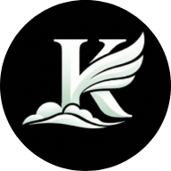

<a href="README.md">
  
</a>
<a href="README-TR.md">
  
</a>

  <br />
  <br />

<div align="center">
  
  <br />
  <br />

  <h1>Mohd Mustak - Personal Interactive Portfolio</h1>

  <p>
     An immersive, high-performance personal portfolio website built with Next.js, Framer Motion, and Three.js.
  </p>


  <p>
    <a href="#features">Features</a> •
    <a href="#projects">Projects</a> •
    <a href="#tech">Technologies</a> •
    <a href="#installation">Installation</a> •
    <a href="DESIGN.md">Design Guidelines</a> •
    <a href="AGENT.md">Workspace Log</a>
  </p>

  <br />
  <br />
</div>

## 📋 About

This is the interactive portfolio of **Mohd Mustak**, a Senior Software Engineer specializing in **Flutter mobile development** and scalable cloud/backend architectures. It features an award-winning horizontal layout, physics-based micro-interactions, custom interactive canvas particles, dual-language toggle (English & Turkish), and deep app store download button integrations.

## <a id="features"></a> ✨ Features

- **Advanced Animations**: Fluid parallax, custom timeline layouts, and spring transitions with Framer Motion.
- **Physics-Based Canvas**: Dynamic UI nodes (like the Hanging Profile) that respond physically to mouse acceleration.
- **Dynamic Projects Slider**: Widescreen horizontal projects track showcasing 6 real-world cross-platform applications.
- **App Store Showcase**: Decoupled asset pipeline displays full-bleed widescreen screenshots on list cards, while loading official 1:1 app icons and horizontal scrolling portrait galleries inside detail modals.
- **Multi-language**: Built-in instant translation switcher (EN / TR).
- **Responsive Layout**: Fluid CSS design that dynamically formats for desktop and mobile viewports.

## <a id="projects"></a> 📱 Showcased Applications

1. **Marhaba Auctions**: Live bidding app with WebSockets, wallet payments, and vehicle lifecycle shipping tracking.
2. **Koor Property**: Gulf-tailored property buying/renting platform with zero marketing budget reaching 10K+ users.
3. **Movermate Crew**: High-performance logistics app with geofencing, calendar schedules, and Stripe Tap-to-Pay.
4. **Counsellor App**: B2B CRM dashboard linking call logs, dialers, and audio recordings.
5. **Spotted**: Fintech cashback rewards platform running QR-code scans, UPI triggers, and wallet payouts.
6. **SSC Exam Prep AI**: Competitive exam prep quiz engine parsing PDFs using Local LLMs (Phi-4) and AI chat.

## <a id="tech"></a> 🛠️ Technologies

- **Next.js & TypeScript**: Type-safe structural base optimizing server renderings.
- **Tailwind CSS**: Modern utility styling and theme token setup.
- **Framer Motion**: Complex interactive gestures and physics springs.
- **Three.js & React Three Fiber**: Lightweight 3D particle visual systems.
- **Lenis**: Silky-smooth inertial mouse/touch scrolling.

## <a id="installation"></a> 🚀 Installation

To run this repository locally:

1. **Install dependencies:**
   ```bash
   npm install
   ```

2. **Start the development server:**
   ```bash
   npm run dev
   ```

3. **Build the production bundle:**
   ```bash
   npm run build
   ```

#

<p align="center">
  <sub>Developed by Mohd Mustak</sub>
</p>